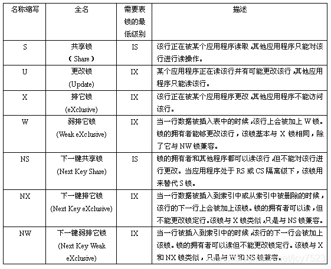

当命令行处理器完成处理命令或SQL语句时，它返回一个返回（或退出）代码。这些代码对于从命令行执行CLP函数的用户是透明的，但是当从shell脚本执行这些函数时，可以检索它们。
CLP:DB2 命令行处理器
例如，以下shell脚本执行
~~~
GET DATABASE MANAGER CONFIGURATION
~~~
命令，然后检查CLP返回码：

返回码描述如下

- 0 ：      DB2命令或SQL语句已成功执行
- 1 ：      SELECT或FETCH语句没有返回任何行
- 2 ：      DB2命令或SQL语句警告 
- 4 ：      DB2命令或SQL语句错误 
- 8 ：      命令行处理器系统错误

## 表空间
1. 查看表所在的表空间：
~~~shell
–-表名大写
select tabname,tbspace from syscat.tables where tabname = ‘表名’;
~~~
2. 查看表的索引：
~~~sql
–-表名大写
select * from syscat.indexes where tabname = ‘表名’;
~~~

## 迁移数据库
- db2move schema export
- db2move schema import

select 1 from 中的1是一常量（可以为任意数值），查到的所有行的值都是它，但从效率上来说，1>xxx>*，因为不用查字典表。

1：select  1 from table       增加临时列，每行的列值是写在select后的数，这条sql语句中是1

2：select count(1)  from table   管count(a)的a值如何变化，得出的值总是table表的行数

3：select sum(1) from table   计算临时列的和

## 创建表、新增字段、插入数据 失败回滚
~~~
# 也可以从输入参数，使用$* 获取全部输入参数
tables=('table1' 'table2' 'table3')

db2 connect to schema
# -v 打印执行的每一条sql view
# -s 参数s的意思是每次遇到报错的命令就停止执行操作，后面的sql就不再执行了 stop
# -t 表示使用分号语句终结符 termin
# -f 表示其后就是读取sql的脚本文件 从输入文件读内容 file
db2 -stvf bak.txt -z table_ddl_1.log
if [[ $? -ne 0 ]];then
    echo "error"
    db2 rollbak
    for arg in ${tables[@]}
    do
        # 设置单独一列但临时空间，该列值都为1
        sql="select 1 from ${arg} fetch first 1 rows only"
        STATE=`db2 ${sql}`
        # =~ 表示${STATE} 字符串中是否包含字符串 “SQLSTATE”
        if [[ ${STATE} =~ "SQLSTATE" ]]
        then
            echo "${arg} NOT EXISTS"
        else 
            db2 "drop table ${arg}"
            echo "drop ${arg} success"
        fi
    done
else 
    db2 commit
fi
db2 disconnect current
# 或者db2 connect  reset
~~~
### decimal()
知道decimal(p[ , s])的意思就能明白了，decimal(10)中默认的s为0，就是说没有小数位，提取10位的整数，舍去小数后的小数位；decimal(10,2)的意思是提取10位的浮点数（包括整数位和小数位，一共10位），取小数点后两位，四舍五入。在DB2中decimal最大精度是31位，小数的范围从-10^31+1到10^31-1。

## 锁
- 脏读：当事务A执行修改数据，但是还未提交，此时事务B却已经读取到了未提交的数据，该数据为脏数据。
- 不可重复读：当事务A执行时间比较长时候，此时有一堆小事务，在修改数据，导致事务A每次同样的执行却读取到不同的数据
- 幻读：当事务A读取数据时候，读取到了10条数据，此时还未提交，同时此时事务B插入了一条数据，导致事务A重新查询时，查出来的数据与上一次不一致。

### 隔离级别

（是表示允许，否表示不允许）

| 隔离级别  | 脏读  | 不可重复读 | 幻读|
| ---- | ---- | ---- |---- |
| 未提交读（Uncommitted Read）  | 是  | 是   | 是|
| 游标稳定性（Cursor Stability）  | 否  | 是 |否|
| 读稳定性（Read Stability） | 否  | 否  | 是|
| 可重复读（Repeatable Read）  | 否  | 否  | 否|

- with ur
ur 就是 Uncommitted Read，即未提交读的隔离级别，允许脏读，不加行锁，作用就是在 select 的时候，不需要对 update 的数据进行等待
- with cs
db2 "select * from xxx with cs ", 这里的 with cs 也可以不写，因为默认的隔离级别就是这种，这种隔离级下，在一个事务中，结果集中只有正在被读取的那一行(游标指向的行)将被加上NS锁，其他未被处理的行上不被加锁。这种隔离级只能保证正在被处理的行的值不会被其他并发的程序所改变。
- with rs
如果使用这种隔离级，在一个事务中所有被读取过的行上都会被加上NS锁，直到该事务被提交或回滚，行上的锁才会被释放。这样可以保证在一个事务中即使多次读取同一行，得到的值不会改变。但是，如果使用这种隔离级，在一个事务中，如果使用同样的搜索标准重新打开已被处理过的游标，则结果集可能改变。(可能会增加某些行，这些行被称为幻影行(Phantom))，对应幻读。这是因为 RS 隔离级别并不能阻止通过插入或更新操作在结果集中加入新行
- with rr
是最严格的隔离级别，如果使用这种隔离级，在一个事务中所有被读取过的行上都会被加上 S 锁，知道该事务被提交或回滚，行上的锁才会被释放。这样可以保证在一个事务中即使多次读取同一行，得到的值不会改变。另外，在同一事务中如果以同样的搜索标准重新打开已被处理过的游标，得到的结果集不会改变。重复读相对于读稳定性而言，加锁的范围更大。

对于读可靠性，应用程序只对符合要求的所有行加锁，而对于重复读，应用程序将对所有被扫描过的行都加锁。例如，如果一个应用程序对一个表中的 10000 行数据进行扫描，最终找到了 100 条符合搜索条件的结果行。如果该应用程序使用的是读可靠性隔离级，应用程序将只对这符合条件的 100 行加锁;如果该应用程序使用的是重复读隔离级，应用程序将对被扫描过的 10000 行都加锁。

### 锁的介绍
[参考博客1](https://blog.csdn.net/somezz/article/details/84844555)
[参考博客2](https://blog.csdn.net/jcy7523/article/details/85006049)
- 表锁

- 行锁

NS锁拥有者和所有并发的事务都可以读（但不能更改）被锁定行中的数据。这种锁用来在使用读稳定性或游标稳定性事务隔离级别读取的数据上代替共享锁。

### 查看和更改与锁相关的主要配置参数 

[参考博客](http://www.noobyard.com/article/p-fnabbbbn-eo.html)

CLP方式： 

~~~
　db2 get db cfg 
　或者
　db2 get db cfg for <dbname>|grep -i lock
　
　db2 get db cfg for <dbname>|grep -i lock
 Max storage for lock list (4KB)              (LOCKLIST) = 4096
 Percent. of lock lists per application       (MAXLOCKS) = 10
 Interval for checking deadlock (ms)         (DLCHKTIME) = 10000
 Lock timeout (sec)                        (LOCKTIMEOUT) = -1
 Block log on disk full                (BLK_LOG_DSK_FUL) = NO
 Block non logged operations            (BLOCKNONLOGGED) = NO
 Lock timeout events                   (MON_LOCKTIMEOUT) = NONE
 Deadlock events                          (MON_DEADLOCK) = WITHOUT_HIST
 Lock wait events                         (MON_LOCKWAIT) = NONE
 Lock wait event threshold               (MON_LW_THRESH) = 5000000
 Lock event notification level         (MON_LCK_MSG_LVL) = 1
~~~

在参数列表中寻找DLCHKTIME、LOCKTIMEOUT、 MAXLOCKS。 
- DLCHKTIME 单位是毫秒。
是DB2检查死锁的间隔时间，假设该值为10000ms，则意味着每隔10秒钟检查一下当前数据库中有无死锁存在，如有死锁，会选择回滚其中的某一个事务，让另外一个事务完成交易。 　

- LOCKTIMEOUT单位是秒。
是锁等待最长时间，超过该时间仍未获得锁，则返回错误，参数指定应用程序为获取一个锁定将等待的秒数，默认值-1 [-1; 0 - 32 767 ]。 缺省情况下，LOCKTIMEOUT是-1，意味着锁等待时间无限期，这和实际应用需求一般是不太相符的，需要将其值设为大于0的一个数。 DLCHKTIME时间通常要设得比LOCKTIMEOUT时间小一些，否则未等发现死锁，就会被以锁等待超时而返回错误。 
- LOCKLIST----此参数指示分配给锁定列表的内存量。
每一个数据库都有一个锁定列表，锁列表包含了并发链接到该数据库的全部应用程序所持有的锁。锁定是数据库管理器用来控制多个应用程序并发访问数据库中数据的机制。行和表均可以被锁定。默认值automatic [4 – 524288]
- MAXLOCKS----此参数定义应用程序挂起的锁定列表的百分比，
必须在数据库管理器执行锁定升级以前填写该列表。当任何一个应用程序持有的锁数量达到这个百分比时，会选取“行锁最多”的表进行锁升级。默认值 automatic [1 – 100]

更改示例（CLP方式） 
~~~
   db2 update db cfg using locktimeout 10 
~~~

###  **锁升级的产生及影响**

**何时会发生锁升级呢？**

其实对每个锁，DB2 数据库都要耗费必定的内存资源来管理并维护（通常状况下，对某个对象上所加的第一个锁须要 256 字节，而在该对象上所加的锁从第二个锁开始就只须要 128 字节了）。 所以，若是在一个表上，有大量的行锁被请求时，为了节约数据库资源的占用，“聪明的”数据库管家会用一个锁住整个表的表锁来代替为数众多的行锁，从而释放了本来大量行锁所占用的资源。 而这个过程，就被称之为锁升级。那么，数据库何时会将行锁自动升级为表锁、锁升级遵循怎样的规律、该如何预测锁升级的发生呢？ 这里就须要提到两个影响数据库锁升级的 DB2 数据库配置参数：

DB2 数据库主要在如下两种情形时会进行锁升级：

（1）   当一个应用的锁所使用的内存 >LOCKLIST × MAXLOCKS

（2）   多个应用的锁使用的内存 >LOCKLIST
### 死锁历史记录
查看event monitor状态
~~~
db2 "select event_mon_state(EVMONNAME) from syscat.eventmonitors"
~~~
查看属性
~~~
db2 "select * from syscat.eventmonitors"
~~~
对锁等待的application 做snapshot
~~~
db2 get snapshot for application agentid 8 
~~~

### 当前已落实

currently commit

DB2 V9.7新特性，当查询的数据被锁住时，直接返回未更改之前的数据。

## 重启数据库

- db2stop force
- db2start

## DB2 创建java-UDF

### 编写java代码
~~~
import COM.ibm.db2.app.UDF;

public class TimeByRegexp extends UDF{
public static int timeByRe(String str, String regexp){
        if (str.matches(regexp)) {
            return 1;
        } else {
            return 0;
        }
    }
}
~~~

## 触发器
### 删除触发器
~~~
db2 drop trigger <trigger_name>
~~~
### 创建触发器
示例：创建update 后的触发器，其中有o 和 n值
~~~
create or replace trigger  update_emp
     AFTER UPDATE OF salary ON employee
     REFERENCING OLD AS o NEW AS n
     FOR EACH ROW
     WHEN (n.salary <> o.salry)
      INSERT INTO audit_emp VALUES (o.empno,'Update',n.salary,current user, current timestamp)
~~~
### 编译java代码
这里要使用db2 自带的jdk编译.java文件
查看db2 java路径
~~~shell
db2 get dbm cfg | grep -i java
~~~
###  编译
javac xxx.java

如果编译过程中出现格式不正确
使用如下命令
~~~
export  JAVA_TOOL_OPTIONS=-Dfile.encoding=UTF-8
~~~
### 放置文件 
将编译后的class文件放到db2 中的function文件夹中
~~~
mv sample.class /home/xxxist/sqllib/function/xxx.class
~~~
### 创建function
简单参考
~~~
set current schema='TEST'
CREATE OR REPLACE FUNCTION count_by_regexp(str varchar(3000),msg varchar(3000))
RETURNS INTEGER
FENCED 
NOT DETERMINISTIC
NO SQL
LANGUAGE JAVA
PARAMETER STYLE JAVA
EXTERNAL NAME 'Count.countByRegexp' 
NO EXTERNAL ACTION
~~~
复杂命令
~~~sql 
DROP FUNCTION WITH_NEW
CREATE OR REPLACE FUNCTION WITH_NEW(str VARCHAR(256), regrex VARCHAR(256)) 
RETURNS INTEGER
SPECIFIC WITH_NEW  -- 取别名
EXTERNAL NAME 'TimeByRegexp!timeByRe'  -- 引入java 类!函数
LANGUAGE JAVA
PARAMETER STYLE JAVA
NOT DETERMINISTIC                   --
FENCED                              --
THREADSAFE
RETURNS NULL ON NULL INPUT
NO SQL
NO EXTERNAL ACTION                  -- 指定函数对内部程序能否有影响
NO SCRATCHPAD
NO FINAL CALL
ALLOW PARALLEL
NO DBINFO
STATIC DISPATCH 
INHERIT SPECIAL REGISTERS
~~~
### 验证
~~~shell
# 查看
select * from SYSCAT.FUNCTIONS WHERE FUNCSCHEMA = 'ifm30'
values xxx.函数名
~~~

## DB2查看字符
### 查看db2 编码
~~~
db2 get db cfg for sample
# 查看 Database code set
~~~
### 字节数

如使用GBK格式，一个字节占2个字节；使用UTF-8 ,一个字节占3个字节。

使用char，默认转换为11个字节，使用to_char,或者trim或自动去除多余的空符号。
~~~
# INTEGER begin_date
values length(begin_date)     # 4
values length(2)              # 4
values length(char(2))        # 11
values length(to_char(2))     # 1
values length(trim(char(2)))  # 1
values length(char('32'))     # 2
values length(to_char('32'))  # 2
~~~